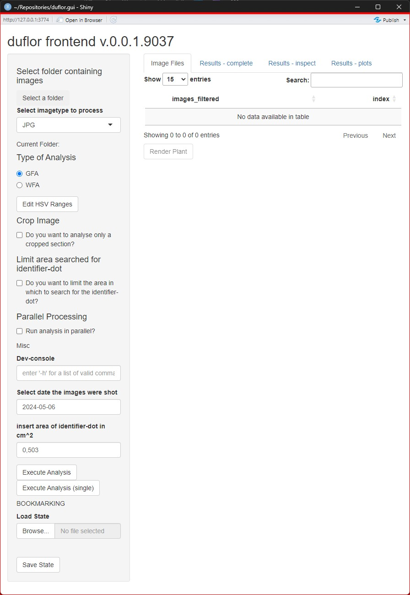

```{r, include = FALSE}
knitr::opts_chunk$set(
  collapse = TRUE,
  comment = "#>"
)
```

```{r setup}
library(duflor.gui)
```

The GUI provided by this package is a front-end to the [duflor](https://Claudius-Appel.github.io/duflor)-package. It follows that the analysis-functions used under the hood will not be documented in this package's documentation.

# General Structure

In figure 1, the general overview of the GUI can be seen.



In general, the GUI is split into two regions. The grey panel on the left side contains all input-controls which are relevant for the setup and configuration of an analysis. That is, all steps which must be done to *get the results* are located here.

Consequently, all buttons/drop-down-menus/tables/other controls which are on the *right* side of the app are pertaining to the results. It should be noted that several of these controls won't do anything until the results have been computed[^1].

[^1]: Buttons may be deactivated, drop-down-menus may not show all relevant options or no options at all, tables might be empty or completely invisible.

## Steps required to run an analysis / Input Controls

This section will deal in detail with the controls in the grey panel.

Generally, the steps are designed to be done in order, from top to bottom[^2]:

[^2]: Obviously they don't *have* to be done in order, they just *should*.

1.  Selecting the folder containing the input images.\
    **Note:** This folder must not contain any images which are not intended to be evaluated, and this extends to sub-folders. If you select folder `foo` to be analysed, then image `foo/bar.png` will be evaluated. However, the images `foo/baz/bar.png` and `foo/baz/another/ridiculous/nesting/plant.png` will also be evaluated.
2.  Selecting the type of analysis to be performed[^3]. Select `GFA` for a `Leaf Area Analysis`/`Grünflächenanalyse`, and `WFA` if you intend to perform a `Root Area Analysis/Wurzelflächenanalyse`.
3.  Optionally, temporarily[^4] modify the HSV-boundaries used for a respective type of analysis. Values must be provided in HSV-color space and in accordance to the following rules:
    1.  $0 \le H_0 \le 359$, $0 \le H_1 \le 359$, $H_0 \lt H_1$
    2.  $0 \le S_0 \le 1$, $0 \le S_1 \le 1$, $S_0 \lt S_1$
    3.  $0 \le V_0 \le 1$, $0 \le V_1 \le 1$, $V_0 \lt V_1$\
        Experience suggests that especially the $V_0$-parameter should be adjusted *very carefully*. This step is explained in further detail in "[Fine-tuning HSV-boundaries]".
4.  Decide whether or not the image should be cropped. Cropping is explained in more detail in "[Cropping Images]".
5.  Decide whether or not to restrict the area within which the identifier-dot truely lies. For more information, see "[Restricting area within which the identifier-dot is quantified]". **Taking this precaution is heavily suggested**.
6.  Decide whether or not the execution should be run in parallel. Parallelisation can significantly reduce execution-time, *particularly for larger image-sets*. It's use is **strongly advised** when the number of images gets above \~40. Below that, it might still be sensible, but the author is not comfortable giving a blanket recommendation. For more information, see "[Parallelised execution]".
7.  Select the date at which the images were shot.
8.  Optionally alter the area for the identifier.
9.  Decide whether or not to analyse all images listed in the tab `Image Files`, or a single one of that set. Pressing either of these buttons will render the GUI unresponsive while executing the respective workflow, until it has been completed and the various results on the right side of the app are being updated.

[^3]: This is technically optional, as all spectra can be selected at will before the analysis-routine is initiated.

[^4]: These changes will be discarded and not saved once the app is shut down or the R-process in which it was spawned is shut down in any manner.

## Post-Execution Steps

After the analysis has finished, the controls of tabs 2-4 on the right side of the app will be updated.

### Tab 2: `Results - complete`

The table in this tab renders the results which will be written to file $1:1$. At the bottom, you may decide whether or not the results will be saved as a `.csv`-file, or as a `.xlsx`-file. Generally the use of `.csv` is suggested for its smaller file-size; but sometimes the output data must be processed afterwards, and then saving the data as an `.xlsx`-file may be advantageous.

### Tab 3: `Results - inspect`

The third tab lets you inspect the results based on a specific spectrum. This table exists for two simple reasons:

1.  The "complete" table is frequently too crowded to be easily digestible, particularly on lower-DPI screens.
2.  By selecting a spectrum and a file, the results of applying said spectrum to the selected file can be viewed (see Figure 2). Optionally, the contrast between "hits" and other pixels can be increased. This can be particularly helpful when trying to identify false positive pixels for a given spectrum (see figure 3)


![Fig.3: High-contrast mask of pixels which are considered part of the identifier-dot. Notice the collection of pixels in the vicinity of the pot which were matched, even though they are obviously false-positives. To counteract this, see "[Restricting area within which the identifier-dot is quantified]". Note that **this step is heavily recommended**.](../man/figures/inspect_green_mask_extreme.PNG)

### Tab 4: `Results - plots`

The fourth tab allows you to view a basic plot for the different KPIs determined.\
Currently, the following KPIs are available:

1.  `area_per_pixel`: This value denotes "how much area"[^5] is equivalent to a single pixel.
2.  For every spectrum analysed, the following KPIs can be viewed and saved as a `.png`-file:
    1.  the resulting `area`[^6],
    2.  the number of matching pixels,
    3.  and the fraction of matching pixels relative to all potential hits\

[^5]: Both the GUI `duflor.gui::duflor_gui()` , as well as the underlying analysis-package `duflor` can calculate the area unit-less. However, the default defined area of the identifier-dot is defined as `r getOption("duflor.default_identifier_area")` $cm^2$

[^6]: assumed to be in $cm^2$

## Edge-cases / special controls

### State-Management: Saving and restoring application configuration to and from files

At the bottom of the grey panel exists a section called "Bookmarking". It allows the user to store the current state of the app's **input** data (configuration, chosen directory-path, relevant data\` to a file, which can be loaded at a later time.

In general, this has two use-cases:

1.  Retaining and restoring common configuration changes for easier access.
2.  Restoring configurations which induced errors, so that they might be debugged in a reproducible manner.\

For more details, see `vignette("saving-and-restoring-application-states", package = "duflor.gui")`.

### Tab 1: `Image Files`

This tab contains the image files which *will* be analysed. However, it also allows you to view an image. This is *particularly* useful for verifying that you correctly cropped the image, and/or correctly selected the area for the identifier-dot (if you did any of these suggested extra steps).

An example of how the application of both would look like can be seen in figure 4.


# Measures for optimising execution speed

## Cropping Images

A very effective way of increasing execution time is to reduce the size of the data- set which is being analysed.

After the desired area has been selected as described above, it can be optionally reviewed on the same (or another) image by pressing the `Render plant`-button on the tab `Image Files`.

An in-depth description can be found in `vignette("image-cropping", package = "duflor.gui")`.

## Parallelised execution

Based on the power of the system running the app, one might consider parallelising the evaluation of images to further reduce computation time. However, its effectiveness depends heavily on the resources available.

An in-depth description can be found in `vignette("parallelisation", package = "duflor.gui")`.

# Measures for maximising accuracy

## Restricting area within which the identifier-dot is quantified

Typically, the largest error-source has been a bad or inconsistent determination of the identifier used to calculate the area of extracted spectra. For information on how to counter this issue, an in-depth description can be found in `vignette("identifier-cropping", package = "duflor.gui")`.

## Fine-tuning HSV-boundaries

Determining the HSV-boundaries can be an arduous and time-consuming process. It is *not* recommended to frequently do this via the GUI, but instead to create a small script calling the relevant functions of the `duflor`-package itself.\
An in-depth guide and further details can be found in `vignette("modifying-hsv-bounds", package = "duflor.gui")`.

# (Advanced) Debugging

Generally, the app tries to give reasonable warnings and status-messages via small red/yellow/blue message boxes. These should be fairly self-explanatory, and will pop up where the author thought them sensible or necessary.
If the app runs into an error, in most cases the configuration required for triggering said error is preserved. For further info, see the section "Saving states when errors occur during analysis" in `vignette("saving-and-restoring-application-states", package = "duflor.gui")`.

# Development, Modifications, Issues

For details on how to raise new feature-requests, please refer to `vignette("raising-issues", package = "duflor.gui")`.

## Reporting issues

This app, and its underlying code can be reviewed with minimal upfront work by opening the source-code from GitHub - either by manually downloading it, or by cloning it via `git`. To do either, navigate to the [duflor](https://github.com/Claudius-Appel/duflor)- or [duflor.gui](https://github.com/Claudius-Appel/duflor.gui)-repository. For details on doing so see `vignette("raising-issues", package = "duflor.gui")`.

## Further development

You are free to take up either of these packages and continue development on them, while abiding to the licensing terms declared.
