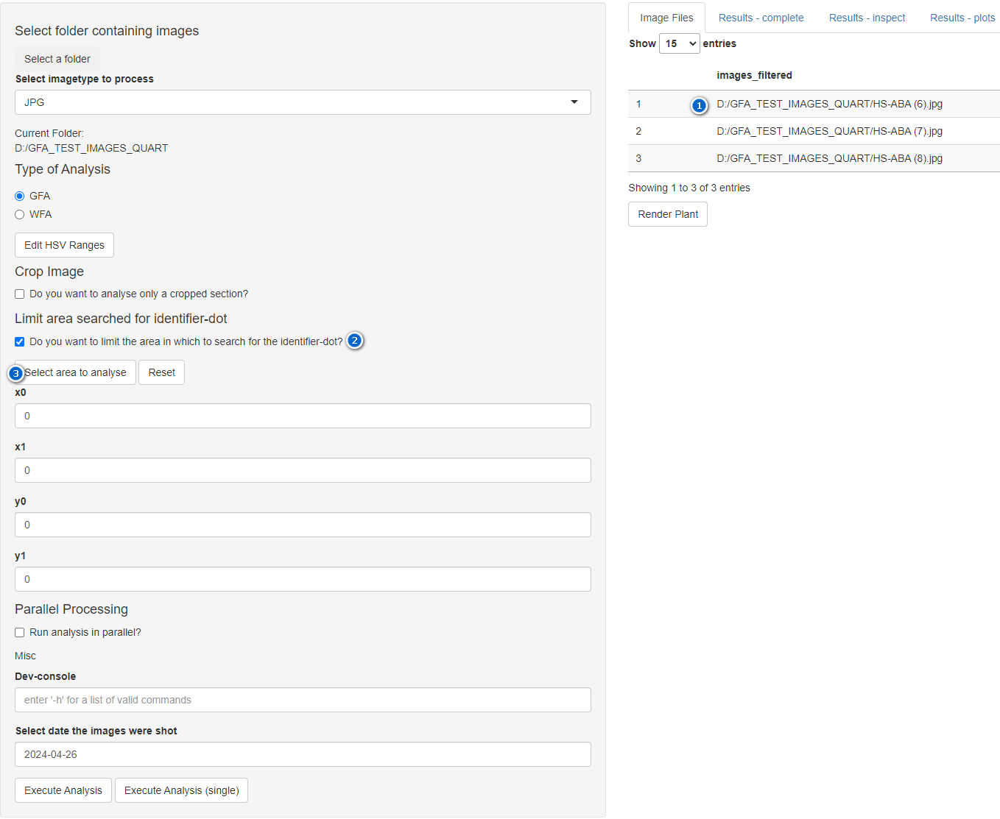
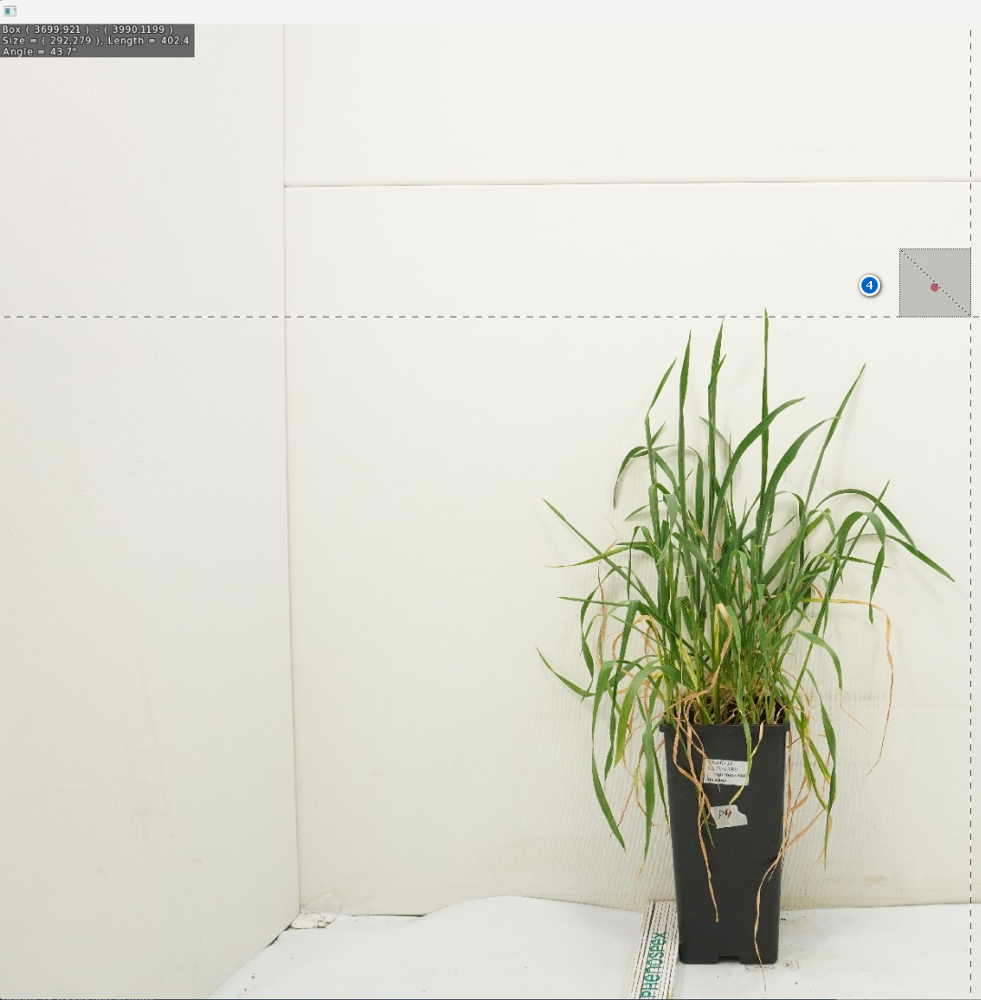

```{r, include = FALSE}
knitr::opts_chunk$set(
  collapse = TRUE,
  comment = "#>"
)
```

```{r setup}
library(duflor.gui)
```

# The problem

Analysing the entire image bears the risk of introducing high error-rates if the determined number of pixels for the "identifier" deviates. Given the difference in the orders of magnitude between the number of "identifier"-pixels and the typical number of pixels for a plant-related spectrum (e.g. "green plant area"), any small deviation in the number of detected "identifier"-pixels compared to other images will drastically influence the computed areas for all spectra. This issue can be observed in the figure below:

![Fig. 1: High-contrast mask of pixels which are considered part of the identifier-dot. Notice the collection of pixels in the vicinity of the pot which were matched, even though they are obviously false-positives. To counteract this, see "[The solution]". Note that **this step is heavily recommended**.](../man/figures/inspect_green_mask_extreme.PNG)

# The solution

To counteract this, the GUI allows you to limit the range within which matches for the identifier-spectrum will be considered "valid". All matches *outside* of this area will be ignored.

To select the area, follow the steps outlined below. Each step corresponds to a number within figures 2 and 3:

1.  Select an image to inspect. You may select any *one* image within the `Image Files`-Tab.
2.  Check the check-box to enable this feature. This will expand a previously-hidden panel.
3.  Next, press the button `Select area to analyse` to launch the window shown in figure 3.
4.  Finally, left-click-and-drag over the area within which the identifier-dot resides. The selection may contain anything, and may be of any size. When you let go, the selection-GUI will close, and the bounding coordinates will be inserted into the respective numeric input controls.

You might be tempted to make it as small as possible. However, while it is certainly advantageous to minimise the area as much as possible, a certain buffer-zone should be kept. As the position of the identifier-dot might differ subtly across all images, a too-strict selection might suddenly exclude pixels which are actually part of the identifier-dot.





# Results

The difference this step can make can be observed in tables 1 and 2. Note that this is a small example, the effect of this preventive step is entirely dependent upon each image, and is thus hard to predict. There can be images which contain almost no impurities, and images which are severely polluted with "invalid" hits.

| bex_identifier_dot_count | bex_drought_HSV_count | bex_drought_HSV_area |
|--------------------------|-----------------------|----------------------|
| 833                      | 297798                | 179.8228019207683    |
| 796                      | 260776                | 164.7868442211055    |
| 870                      | 262390                | 151.7036436781609    |

: Table 1: Number of pixels for the 'identifer_dot', as well as the resulting area for an example-drought spectrum based on a given number of matched pixels. In this case, all qualified "identifier"-pixels were used to determine areas.

| bex_identifier_dot_count | bex_drought_HSV_count | bex_drought_HSV_area |
|--------------------------|-----------------------|----------------------|
| 824                      | 297798                | 181.7868859223301    |
| 783                      | 260776                | 167.5227688378033    |
| 822                      | 262390                | 160.5622506082725    |

: Table 2: Restricting the area in which the identifier-dot lies changes a given spectrum's calculated area.
