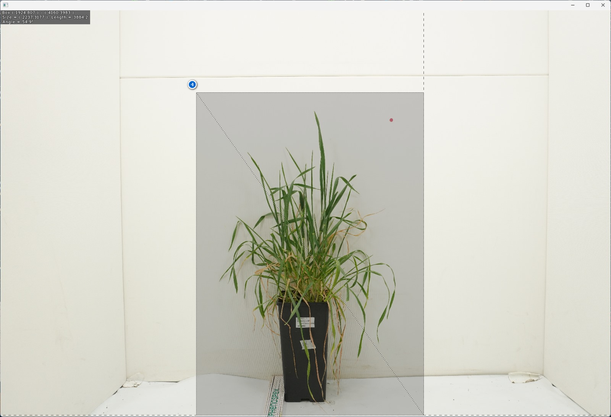

```{r, include = FALSE}
knitr::opts_chunk$set(
  collapse = TRUE,
  comment = "#>"
)
```

```{r setup}
library(duflor.gui)
```

# The problem

When taking images of a pot in a photo-box, there are frequently regions within the image which are of no relevance to the results. Figure 1 displays a typical photo which will be analysed. Please ignore the rectangle around the pink identifier-dot, as well as the information printed in the top-left corner for now.


Large regions to the left, right and top of the plant and pink dot are completely irrelevant to the analysis. These pixels can be happily ignored. In fact, *not excluding* them would result in unnecessary iterations during the analysis, which can significantly increase the time required for an analysis to complete.\
This time-loss increases linearly with the number of analysed images.

# The solution

To counteract this, the GUI allows you to select a rectangular sub-set of the full image which will be analysed instead.

To select the area, follow the steps outlined below. Each step corresponds to a number within figures 2 and 3:

1.  Select an image to inspect. You may select any one image within the Image Files-Tab
2.  Check the check-box to enable this feature. This will expand a previously-hidden panel.
3.  Next, press the button Select area to analyse to launch the window shown in figure 3.
4.  Finally, left-click-and-drag over the area within which both the plant **and the identifier-dot** reside. The selection may contain anything else, and may be of any size. When you let go, the selection-GUI will close, and the bounding coordinates will be inserted into the respective numeric input controls.




