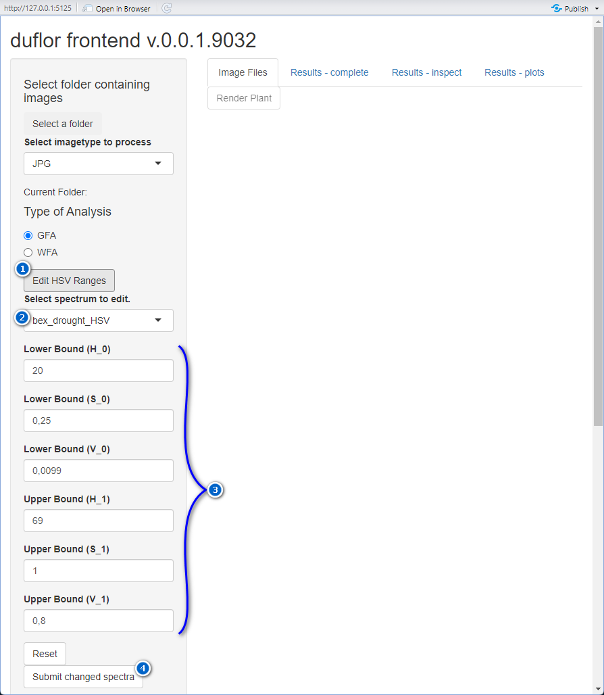

```{r, include = FALSE}
knitr::opts_chunk$set(
  collapse = TRUE,
  comment = "#>"
)
```

```{r setup}
library(duflor.gui)
```

# Introduction

The default values for the HSV-spectra provided via the shiny-application are set in the back-end-package "[duflor](https://github.com/Claudius-Appel/duflor)", **not frontend-package "[duflor.gui](https://github.com/Claudius-Appel/duflor.gui)"**.

There are two methods of altering the HSV-bounds use during analysis. The first one can be performed from within the GUI, and will only take effect during the current session. **Restarting the GUI or the R-session will not purge any changes issued this way**[^1].

[^1]: There are many other ways this can happen, but the fundamental rule is that closing and re-opening the GUI front-end will discard any temporary changes.

The second one can be used to change values before the app starts, however it requires additional setup on the side of the user and must be invoked in a specific manner each time.

## Scales required for the different components of an HSV-triplet

It is important to understand the format and limitations within which values for the respective *Hue*-, *Saturation*- and *Value*-Components must be provided.

Input-values must be provided in HSV-color space and in accordance to the following rules:

1.  $0 \le H_0 \le 359$, $0 \le H_1 \le 359$, $H_0 \lt H_1$
2.  $0 \le S_0 \le 1$, $0 \le S_1 \le 1$, $S_0 \lt S_1$
3.  $0 \le V_0 \le 1$, $0 \le V_1 \le 1$, $V_0 \lt V_1$\
    Experience suggests that especially the $V_0$-parameter should be adjusted *very carefully*.

## Finding suitable bounds

There is no simple or fast method to fine-tuning the HSV-bounds when required.

However, repeatedly performing small changes to a spectrum and checking the results via the GUI **is *really not suggested***. Instead, perform the following steps:

1.  Select a test-image based upon which changes are to be judged
2.  Create a separate R-Script, and paste the following contents:

```{r ex-finetune-spectrums-standalone, eval=FALSE}
library(duflor)
## setup 
test_file <- r"(PATH/TO/TESTFILE/HERE.FILETYPE)"
spectrums <- getOption("duflor.default_hsv_spectrums")

## Optional: remove all spectrums you do NOT want to modify, leaving ONLY one (here: 'bex_drought_HSV')
# You can skip this step if you want

spectrums_modified <- spectrums
    
spectrums_modified$lower_bound <- duflor:::remove_key_from_list(spectrums_modified$lower_bound,c("bex_green_HSV","bex_complete_HSV","bex_root_HSV","bex_identifier_dot"))
spectrums_modified$upper_bound <- duflor:::remove_key_from_list(spectrums_modified$upper_bound,c("bex_green_HSV","bex_complete_HSV","bex_root_HSV","bex_identifier_dot"))

## change the bounds you want to check a little:

spectrums_modified$lower_bound$bex_drought_HSV <- c(18.0, 0.25, 0.0099) # modify the values here
spectrums_modified$upper_bound$bex_drought_HSV <- c(70.0, 1.0, 0.8)

## load image
pixel.array <- load_image(test_file,return_hsv = T)
## extract hits - do not change the details of this code unless you know what you are doing
HSV_mask <- extract_pixels_HSV(
    pixel.array = pixel.array,
    lower_bound = spectrums_modified$lower_bound,
    upper_bound = spectrums_modified$upper_bound,
    fast_eval = T,
    bundle_pixelarray = F,
    check_value = T,
    use_single_iteration_cpp = T
)
## apply mask to image to see which pixels were hit
# in some cases, it might be useful setting 'mask_extreme' to 'TRUE'
indicator.array <- get_indicator_image(
    pixel.array = pixel.array,
    pixel.idx = HSV_mask$bex_drought_HSV$pixel.idx,
    target.color = "orange",
    mask_extreme = FALSE
)
## display applied mask
imager::display(duflor::HSVtoRGB(indicator.array))
```

3.  Modify the script as desired (e.g. change which spectrum you are modifying, select a suitable image to test on).
4.  Once you have found a set of bounds you are content with, you can note down the respective HSV-values and implement them as described in "[Modifying HSV-boundaries...]".

# Modifying HSV-boundaries...

## ... temporarily via the GUI

Any changes to HSV-spectra issued in one session via the GUI (as described below) will not persist across R-sessions.

On occasion a spectrum's HSV-boundaries must be modified - and in this case, a spectrum can be altered. To do so, follow the steps outlined below, corresponding to the respectively annotated controls in figure 1.

1.  Open the editing-panel
2.  Select a spectrum to modify. All spectra listed here are available for use within the GUI.
3.  For the selected spectrum, modify the respective values.
4.  Submit the performed changes. Note that when multiple spectra are to be modified, this button **must be pressed for every modified spectrum separately**.
5.  Optionally, the currently selected spectrum can be reset to its default values.



## ...permanently by loading modified state-file

This method is recommended over the steps outlined in "[...pseudo-permanently by changing underlying option before opening the GUI]".

The state-management system outlined in the section "Saving and restoring common states" of the vignette `vignette("saving-and-restoring-application-states", package = "duflor.gui")` can be used to save modified settings, and thus also changes to the *existing* HSV-ranges.

To do so, first change the HSV-spectra as desired via the steps outlined in "[... temporarily via the GUI]". Following that, save this state of the app to a state-file.

## ...pseudo-permanently by changing underlying option before opening the GUI

This method is not recommended, but remains documented for the sake of completeness. It is likely significantly easier to follow the steps outlined in "[...permanently by loading modified state-file]".

There is no true "do-once-and-forget-about-it" method of changing spectra. The "most-persistent" method to modify a spectrum is described below:

1.  Create a new R-Script, and save it somewhere. It should have a reasonably distinct name. From now on, you will no longer call `duflor_gui()` itself, instead you must always run this script to run the GUI with the changes applied at startup.
2.  Within the script, add the following lines:

```{r ex-spectrums-change-persistent, eval=FALSE}
library(duflor) # initialise the spectrums-option
spectrums <- getOption("duflor.default_hsv_spectrums") # then retrieve them
spectrums$lower_bound$bex_drought_HSV <- c(18.0, 0.25, 0.0099) # example, modify the values here for the desired spectrum
spectrums$upper_bound$bex_drought_HSV <- c(70.0, 1.0, 0.8)
options(duflor.default_hsv_spectrums = spectrums) # update the option

duflor.gui::duflor_gui() # and run the app
```

3.  From now on, running this script will apply the changes I made to the spectrum `bex_drought_HSV` before opening the app.

It must be noted that these modified spectra will be used as the base-line. When further altering them temporarily as described in "[... temporarily via the GUI]", resetting these changes will reset them to the values modified here. The 'true' default values cannot be retrieved this way. To access them again, **the R-session must be restarted**, or the changes must be manually reversed by the process described above.

**Additionally, values modified in this manner can not be checked against fulfilling the scales described in "[Scales required for the different components of an HSV-triplet]". Thus, the responsibility for ensuring compliance with the restrictions noted above lies with the user writing the script.**

# Adding new HSV-boundaries

The process of adding a new HSV-spectrum is similar to the one required for modifying a pre-existing spectrum:

1.  Create a new R-Script, and save it somewhere. It should have a reasonably distinct name. From now on, you will no longer call `duflor_gui()` itself, but instead must always run this script to run the GUI
2.  Within the script, add the following lines:

```{r ex-spectrums-add-new-spectrum-persistent, eval=FALSE}
library(duflor) # initialise the spectrums-option 
spectrums <- getOption("duflor.default_hsv_spectrums") # then retrieve them 
spectrums$lower_bound$new_spectrum <- c(1,2,3) # add a new spectrum
spectrums$upper_bound$new_spectrum <- c(4,5,6)
options(duflor.default_hsv_spectrums = spectrums) # update the option

duflor.gui::duflor_gui() # and run the app 
```

3.  From now on, running this script will insert the new spectrum `new_spectrum` each time the app is started via this script.
