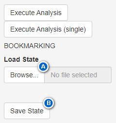

```{r, include = FALSE}
knitr::opts_chunk$set(
  collapse = TRUE,
  comment = "#>"
)
```

```{r setup}
library(duflor.gui)
```

# Introduction

This app has the ability to store its configuration-state permanently across sessions, so it can be restored at a later state - or on a different machine.

# Saving and Restoring common states

The most common use-case for the user is to save and restore config-changes across sessions.

Let's build a hypothetical scenario, in which you perform an experiment on a set of experimental groups over 10 weeks. Each week, all pots across all groups are imaged, and these images are analysed to determine the development of leaf-area over time. Let's further assume that certain settings are changed from their standard values, for instance:

-   the HSV-boundaries of a specific spectrum which must be analysed were tweaked
-   the declared area for the identifier-dot was changed from its default value

Recreating these modifications every time a set of images must be analysed for this experimental setup has an enormous potential for inducing errors along the way.

To counteract this, the user may save the **current configuration of all input**-controls and settings to a file (see step (A) in figure 1.

These changes can later be reloaded from the same file (step (B) in figure 1.



**Note that the following limitations apply**:

1.  This system is agnostic to outside changes:
    1.  The to-be-analysed image-files **are not stored**. Instead, the directory-path to the selected folder is. However, if the images are moved after the application-state was saved, these images will no longer be found.
    2.  Options which cannot be modified via the GUI will not be stored.
2.  The state of certain data-objects change dynamically, and performing an analysis also affect this. This has two consequences:
    1.  Assume you load configuration `X`, perform an analysis with it, *then* change the HSV-bounds for a specific spectrum, and finally save the state *without* re-executing the analysis. As a result, the HSV-spectra in the stored state-file differ from those used for the analysis. If the user were to load this state and execute it, the new results would not be identical to the previous version.
    2.  While a "state" technically stores the general `DATA`-object which also contains the results-data (if it was computed before the state-file is generated), this data will not be rendered when a state is loaded. The `DATA`-object is essentially only stored for internal purposes, **not** to retain the results-data across sessions.

# Saving states when errors occur during analysis

Additionally to the process of manually saving the application-state, the application generates state-files if an error occurs during the execution of certain subroutines:

-   `input$submit_selected_spectra`: The callback which issues the analysis of images, from loading the images up to the generation of the results

    -   This is **the** subroutine responsible for computing analyses, all steps required to obtain the results-table and figures branch off from here.

Error-states are saved relative to the selected input-folder containing the input-images. These states are not supposed to be used manually, instead they are generated so that issues can be found easier. When issues are reported, such state-files should be supplied if available.

When this application is installed as a built package, its internal functions and logic-flow become somewhat harder to debug. Thus, it is recommended to load the application as a source-code package-project via `{devtools}` when inspecting bugs.

[**Error-states are not deleted automatically, and can accumulate. Be sure to remove them when they outlived their usefulness.**]{.underline}
